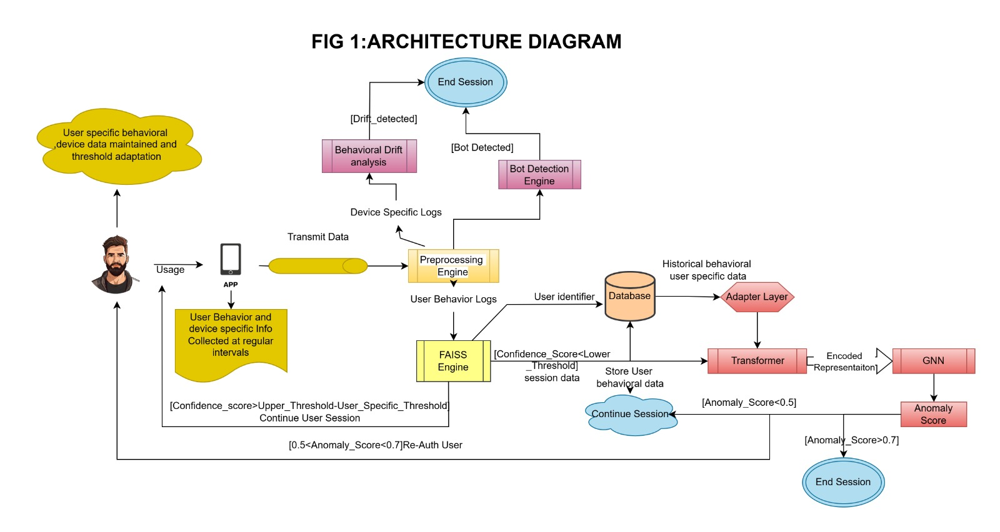

# BRIDGE  
**Behavioral Risk Intelligence for Dynamic Guarded Entry**  
*SuRaksha Cyber Hackathon*  
**Team “five”**  
- Chanikya Sai Nelapatla 
- Logarathan S V 
- Sanjeev A  

---

## Theme:  
**Enhancing Mobile Banking Security through Behavior-Based Continuous Authentication**

---

## 1. Problem Statement

### Background
Traditional mobile banking apps authenticate users only at login. Once inside, the app assumes the same user remains active, leaving a critical window for session hijacking, device sharing, or app cloning.

### Core Problem
**No continuous validation** of the user after login, exposing sessions to hijack, impersonation, and malware threats.

### Objectives
- **Continuous, passive authentication** using behavioral biometrics (touch, typing, device interaction).
- **Cloud-based analysis** to prevent on-device tampering.
- **Zero user friction**: Security without disrupting the user experience.

### Gaps in Existing Solutions

| Method                | Limitation                                      |
|-----------------------|-------------------------------------------------|
| One-time login        | No protection after session starts              |
| Biometric verification| Can be spoofed (masks, recordings, photos)      |
| OTP-based systems     | Vulnerable to SIM swap, phishing                |
| Local checks          | Bypassed by rooted/jailbroken devices, malware  |

### Threats Addressed
- Unauthorized use after login (device sharing, session hijack)
- App cloning and token theft
- Biometric or pattern spoofing
- Malware or debugging altering app behavior

### Expected Outcome
- **Every session is continuously validated.**
- **Anomalies are detected in real time.**
- **Immediate action:** re-authentication or session block.

---

## 2. Solution Overview

### BRIDGE: Behavioral Risk Intelligence for Dynamic Guarded Entry

A **multi-layered, real-time behavioral authentication system** for mobile banking, combining advanced AI, secure cloud infrastructure, and seamless user experience.

---

## 3. System Architecture


*Figure 1: System Architecture Diagram (Visual)*

- **Flutter App:** Captures user behavior (touch, scroll, device info) and streams to backend.
- **Backend API:** Manages sessions, routes data, and communicates with ML engine.
- **ML Engine:**  
  - **FAISS:** Fast vector similarity for behavioral matching.  
  - **GNN (Graph Neural Network):** Deep anomaly detection with user-adaptive models.  
  - **Informer Transformer:** Temporal encoding for session context.  
  - **Drift Tracker:** Detects device/IP/location changes (impossible travel, hijack).
  - **Audit & Explainability Engine:** Logs every decision for compliance.
- **Supabase:** Secure, scalable storage for user/session data and audit logs.
- **Security Dashboard:** (Optional) For monitoring and compliance.

---

## 4. Technology Stack

| Layer         | Technology/Frameworks                                      |
|---------------|------------------------------------------------------------|
| Mobile App    | **Flutter** (Dart)                                         |
| Backend API   | **FastAPI** (Python, async, scalable)                      |
| ML/AI Engine  | **PyTorch**, **FAISS**, **PyTorch Geometric (GNN)**, **Informer** |
| Database      | **Supabase** (Postgres, Storage Buckets)                   |
| Deployment    | **Docker** (containerized microservices)                   |
| Logging/Audit | Supabase Storage, custom audit engine                      |

---

## 5. Key Features & Capabilities

- **Continuous Behavioral Authentication:**  
  Real-time analysis of user touch, typing, and device patterns.
- **Multi-Level Anomaly Detection:**  
  - **Level 1:** FAISS vector similarity (fast, low-latency)
  - **Level 2:** GNN escalation for complex/ambiguous cases
  - **Drift Tracker:** Device, IP, and location change detection
- **Audit & Explainability:**  
  Every decision, score, and anomaly is logged for traceability.
- **Adaptive Security:**  
  Dynamic thresholds, user-specific models, and session-based learning.
- **Seamless User Experience:**  
  Invisible to genuine users; instant block/reauth for threats.
- **Scalable & Secure:**  
  Cloud-native, async, and stateless APIs with strong data isolation.

---

## 6. Unique Selling Points (USP)

- **First-of-its-kind**: Combines FAISS, GNN, and Informer for adaptive, real-time behavioral authentication.
- **User-Adaptive Models**: Each user’s history is used to personalize anomaly detection.
- **Drift Tracking**: Detects impossible travel, device swaps, and session hijacks instantly.
- **Audit-Ready**: Full explainability and compliance logging for banking standards.
- **Plug & Play**: Easily integrates with any mobile app (Flutter) and backend.
- **Performance**: Caching, async processing, and vector search for real-time response.

---

## 7. Real-World Relevance

- **Banking & Finance**: Prevents account takeover, session hijack, and bot attacks.
- **Regulatory Compliance**: Full audit trail for every authentication decision.
- **User Trust**: Security without friction—no extra steps for genuine users.

---

## 8. Getting Started

### Prerequisites

- Docker & Docker Compose
- Supabase project (with API keys)
- Python 3.9+ (for local dev)
- Flutter SDK (for mobile app)

### Environment Variables

Create a `.env` file in the root with:

```
SUPABASE_URL=your_supabase_url
SUPABASE_KEY=your_supabase_service_key
MPIN_LENGTH=5
# Add other required variables as per ml-engine/.env.example
```

---

## 9. Running with Docker

```bash
# Build and start all services
docker-compose up --build
```

- **Backend API**: http://localhost:8000
- **ML Engine**: http://localhost:8001
- **Supabase**: Managed externally (cloud)

---

## 10. Project Structure

```
bridge/
│
├── ml-engine/                # ML engine (FAISS, GNN, drift tracker, audit)
├── backend/                  # FastAPI backend (session, user, API)
├── final_testing/            # Automated test suite (registration, login, scenarios)
├── mobile_app/               # Flutter app (behavioral event capture)
├── data/                     # Test data, logs, session vectors
├── docker-compose.yml        # Multi-service orchestration
├── .env                      # Environment variables
└── README.md                 # This file
```

---

## 11. Testing

- **Automated End-to-End Tests:**  
  Run from `final_testing/` to simulate registration, login, normal, bot, traitor, and hijack sessions.
- **Standalone GNN Escalation Test:**  
  `final_testing/test_gnn_escalation.py` for local GNN anomaly detection.

---

## 12. How BRIDGE Stands Out

- **Multi-layered, adaptive security**: Not just one model, but a pipeline of fast and deep AI.
- **Real-time, continuous authentication**: No more “login and forget”—security is always on.
- **Explainable & auditable**: Every decision is logged, traceable, and compliant.
- **Cloud-native, scalable, and modular**: Ready for real-world banking deployment.
- **User-first**: Security that’s invisible to genuine users, but ironclad against attackers.

---

## 13. Team & Acknowledgements

**Team “five”**  
- Chanikya Sai Nelapatla  
- Sanjeev A  
- Logarathan S V  

*SuRaksha Cyber Hackathon 2025*  
*Theme: Enhancing Mobile Banking Security through Behavior-Based Continuous Authentication*

---

## 14. License

MIT License


---

## 15. Docker Compose Example

```yaml
version: '3.8'
services:
  backend:
    build: ./backend
    ports:
      - "8000:8000"
    env_file:
      - .env
    depends_on:
      - ml-engine
  ml-engine:
    build: ./ml-engine
    ports:
      - "8001:8001"
    env_file:
      - .env
  # Add other services as needed
```

---